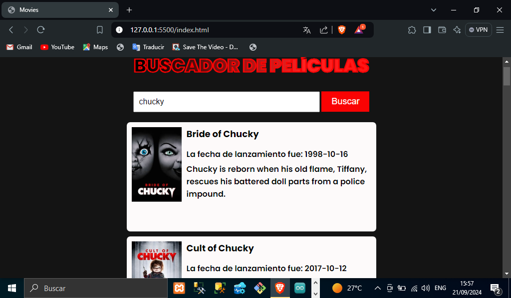

# TITULO DEL PROYECTO    

**Aplicación Web Buscador de Películas**

# DESCRIPCIÓN DEL PROYECTO
**En este proyecto se realizó un buscador de películas el cual se hizo a través del consumo de una API la cual contiene la mayoría de películas, pudimos realizar esta aplicación web con los conocimientos necesarios en HTML, CSS Y JavaScript para su funcionamiento. A continuación explicamos cómo realizamos esta aplicación mas a detalle**

# VISTA PREVIA DE COMO SE VE NUESTRA APLICACION YA FUNCIONANDO



# Manejo de api_key y url de la API

**Para poder realizar nuestra aplicación lo que hicimos fue consumir una API que nos trae la información de las películas la cual estemos buscando a través del buscador, cabe señalar que tenemos que registrarnos en dicha API para poder generar una api_key que es una clave única que nos brinda la API para que puede haber una comunicación segura a la hora de pedir los datos**
[Url de la API:](https://api.themoviedb.org/3/search/movie)

# Funcionamiento del Input y el botón cuando buscamos la película

**Para poder buscar una película en específico lo que hicimos primero fue hacer uso de algunas propiedades que JavaScript posee como por ejemplo la propiedad document.getElementById para poder comunicar con el HTML a través de su id ,además hicimos uso de la propiedad addEventListener que este lo que hace es poder escuchar un evento en un elemento HTML en este caso el evento click en el botón ,como lo mostramos a continuación:**

```JavaScript 
    document.getElementById('searchButton').addEventListener('click', searchMovies)
```
# Llamado de la API con la propiedad fetch de JavaScript

**En esta parte de nuestro proyecto lo que sigue es hacer el llamado de API con JavaScript podemos ver que en nuestro archivo script.js declaramos una variables que es api_key, url y url_image para poder mostrar la imagen de la portada de la película además declaramos otra variable para poder ver los resultamos que nos arroja la API, luego creamos una función llamada searchMovies como mostramos a continuación ya con el fetch incluido:**

```JavaScript
    function searchMovies(){
    resultContainer.innerHTML = 'Cargando...'
    let searchInput = document.getElementById('searchInput').value

    fetch(`${url}?api_key=${api_key}&query=${searchInput}`)
    .then(response => response.json())
    .then(response => displayMovies(response.results))

}
```
# Mostrar Películas en el DOM(función DisplayMovies)
**Para poder mostrar las películas en la página web realizamos una función llamada displayMovies esta función recibe como parámetro las movies que nos da como respuesta la API. lo primero fue validar si el array viene vacío mostrar un párrafo que diga no se encontraron resultados como se muestra a continuación:**
```JavaScript
    if(movies.length === 0){
        resultContainer.innerHTML= '<p> No se encontraron resultados para tu búsqueda </p>'
        return
    }
```

# Mostrar Películas en el DOM(ciclo forEach)

**Ahora si hubiese más de una película vamos hacer un ciclo forEach donde vamos a ir creando elementos HTML en este caso son div,h2 y p para cada película esto a través de la propiedad de JavaScript createElement, así mismo vamos agregando clases CSS con la propiedad classList.add y con el textContent para agregar los h2 y los párrafos como se muestra en el siguiente fragmento de código:**

```JavaScript
    movies.forEach(movie => {
        let movieDiv = document.createElement('div')
        movieDiv.classList.add('movie')

        let title = document.createElement('h2')
        title.textContent = movie.title

        let releaseDate = document.createElement('p')
        releaseDate.textContent = 'La fecha de lanzamiento fue: ' + movie.release_date

        let overview = document.createElement('p')
        overview.textContent = movie.overview
    }
```
# Mostrar Películas en el DOM(Mostrar poster de la película(Imagen))
**Para mostrar la imagen que nos da la API haremos uso de la variable que anteriormente declaramos llamada urlImage y hacemos uso de la propiedad createElement para insertar una etiqueta img. Todo esto en la misma función DisplayMovies como lo muestro a continuación:**
```JavaScript
    let urlImage = 'https://image.tmdb.org/t/p/w200'

    let posterPath = urlImage + movie.poster_path
    let poster = document.createElement('img')
    poster.src = posterPath
```
# Mostrar Películas en el DOM(Manejo de appendChild)
**Por ultimo hacemos uso de la propiedad appendChild de JavaScript para poder insertarle los datos al div que creamos al inicio(movieDiv) y poderle insertar la imagen, el título, descripción y la fecha de lanzamiento. por ultimo hacemos un appendChild final para poder colocarlo en la variable resultcontainer que es el contenedor que agregamos vacío. para ver el código mas a detalle y completo consultar nuestro archivo script.js del repositorio. Manejo del appendChild de JavaScript en el proyecto:**
```JavaScript
    movieDiv.appendChild(poster)
        movieDiv.appendChild(title)
        movieDiv.appendChild(releaseDate)
        movieDiv.appendChild(overview)
    resultContainer.appendChild(movieDiv)
```
### Lista De Tecnologías, Propiedades Del Lenguaje(JavaScript) Y Herramientas Usadas En Nuestro Proyecto(Buscador De Películas)  

1. HTML
2. CSS 
3. JavaScript(Manejo de API)
4. Manipulación De DOM(JavaScript)
5. Propiedades JavaScript(appendChild,document.createElement,textContent,innerHTML,document.getElementById y addEventListener)    
6. GitHub
7. Herramienta de Visual Studio Code(live Server)
8. API(https://api.themoviedb.org/3/search/movie)

*Elaborado Por: Mario Martínez Aguilar*
 
